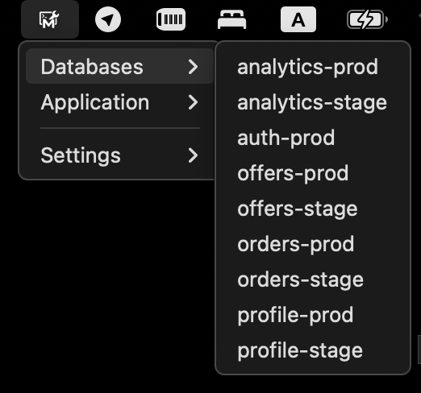

# **MakeTray**

**MakeTray** is a tiny macOS menu‑bar app that lets you launch any Makefile target with a single click—no terminal juggling, no remembering command names.



## **Key Features**

| **What you get**              | **Details**                                                                                                      |
| ----------------------------- | ----------------------------------------------------------------------------------------------------------------- |
| **One‑click targets**         | Every Makefile target appears as its own menu item—grouped by Makefile and shown with your custom label.          |
| **Live auto‑reload**          | Any change to `config.json` **or** to the Makefiles is detected instantly – menus refresh without relaunching.    |
| **Config GUI**                | “Manage Makefiles” submenu lets you add files via **Choose File** dialog, rename labels, or trigger a manual reload. |
| **Terminal output**           | Each target opens a new Terminal window so you can watch logs in real time—window auto‑closes if you want.        |
| **Zero clutter**              | Runs as an *LSUIElement*: no Dock icon, no Cmd‑Tab entry—just a tidy glyph in the menu bar.                        |

## **Installation**

1. **Clone the repo**

```
git clone https://github.com/alexrett/make-tray.git
cd make-tray
```

2. **Install Go modules**

```
go mod tidy
```

3. **Build the app bundle**

```bash
make build      # => dist/MakeTray.app  (universal binary)
```

### Pre‑built releases

Every push to `main` creates signed & notarized binaries for **Intel** and **Apple Silicon**.  
Grab the latest `.dmg` or `.zip` from the [Releases](https://github.com/alexrett/make-tray/releases) page and drop **MakeTray.app** into `/Applications`.

## **Quick Start**

1. **Launch MakeTray** – the first start creates  
   `~/Library/Application Support/MakeTray/config.json` with a single demo entry.

2. **Edit your Makefile**

   Add or tweak targets—MakeTray picks them up automatically.

## **Configuration file**

* Location: `~/Library/Application Support/MakeTray/config.json`
* Format:

  ```jsonc
  {
    "makefiles": [
      { "path": "~/work/project/Makefile", "label": "Makefiles for application" },
      { "path": "$HOME/dev/db/Makefile",   "label": "Databases connections"  }
    ]
  }
  ```

You can edit this file manually or use **Manage Makefiles ▸ Add…** from the menu.

## **Advanced Usage**

| **Scenario**                              | **Command / Setting**                                         |
| ----------------------------------------- | ------------------------------------------------------------- |
| Custom config path                        | `MakeTray -config /path/to/my.json`                           |
| Open config in VS Code                    | *Manage Makefiles ▸ Open config…*                             |
| Manual menu reload                        | *Manage Makefiles ▸ Reload now*                               |
| Keep Terminal window open                 | Comment out the `osascript` *close‑window* line in `main.go`. |
| Replace app icon                          | Put new **icon.png** (menu glyph) + regenerate **icon.icns**. |

## CI / CD

GitHub Actions workflow **release.yml** builds a universal macOS binary (`arm64` + `amd64`), codesigns and notarizes it,  
then uploads `MakeTray.app.zip` and a ready‑to‑mount `.dmg` to the Release tagged by the commit.

*On every push to `main` the workflow also runs `go vet` and `go test ./...` to keep the codebase healthy.*

## **Contributing**

Pull requests are welcome!

1. Fork → feature branch → PR.
2. Follow go vet and golangci-lint checks.
3. Add yourself to CONTRIBUTORS.md.

## **License**

Released under the [MIT License](LICENSE).